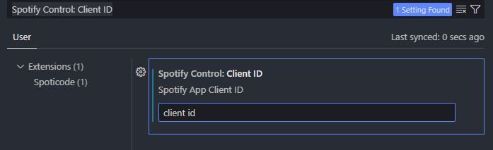

# Spoticode: VSCode Spotify Controller

## Build and Install

### Build frontend

```bash
# Go to media directory
cd media

# Install Frontend dependencies
npm install

# Build React App
npm run build
# npm run watch - To automatically build when making changes
```

### Running dev extension

In the root directory

```bash
# Install Extension dependencies
npm install
```

### Run in Dev Environment

Then open the command palette (`ctrl+shift+p`) and run `Debug: Start Debugging`

### Production Build and Installation

To build a production `.vsix` package.

```bash
vsce package
```

And install to vscode by running

```bash
code --install-extension spoticode-extension-0.0.1.vsix # Repalce with actual `.vsix` file name
```

## Using the Extension

> Note: The user needs a Spotify Premium account to use most of the features

### Setting Client ID

**This step is only needed the first time on a device. If Settings Sync is on, then the Client ID will be synced on any other devices**

You will need a valid spotify app Client ID. Get one from <https://developer.spotify.com/>  
IMPORTANT: make sure to set the redirect URI to `http://localhost:43897/callback`

In the Debug Vscode window:

1. Open Settings
2. Search 'Spotify Control: Client ID'
3. Input your client ID in the text field



### Connect Account

In the command palette, run `Spoticode: Connect Spotify Account` and follow the steps
